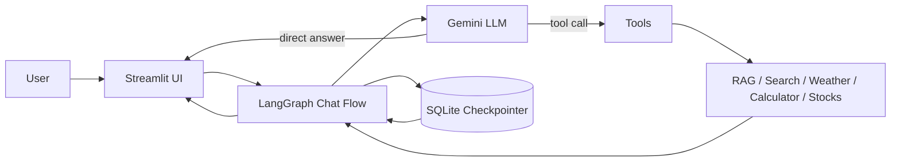

# Agentic Chatbot with LangGraph

[](https://www.python.org/)
[](#license)
[](https://streamlit.io/)
[](https://www.docker.com/)
[](https://www.langchain.com/)
[](https://ai.google.dev/)
[](https://github.com/<OWNER>/<REPO>/stargazers)
[](https://github.com/<OWNER>/<REPO>/commits/main)

> A modern, tool-aware AI assistant built with LangGraph and Streamlit for conversation memory, PDF-based RAG, web search, calculations, weather lookups, and human-in-the-loop approvals.

## Project Description

**Agentic Chatbot with LangGraph** is an intelligent conversational workspace that helps users ask questions, upload PDFs, search the web, perform calculations, and interact with external tools through a controlled agentic workflow.

It solves the problem of building a single assistant that can combine **retrieval-augmented generation (RAG)**, **persistent chat history**, and **tool execution** in one interface. The app is designed for:

- Developers building agentic AI applications
- Recruiters evaluating practical GenAI experience
- Teams that need a lightweight knowledge assistant for documents
- Users who want a clean, chat-based AI interface with memory and tools

## Features

- 🤖 **Agentic reasoning** with LangGraph for tool-aware conversation flows
- 📚 **PDF ingestion and RAG** for grounded answers from uploaded documents
- 🧠 **Persistent conversation memory** backed by SQLite checkpoints
- 🏷️ **Auto-generated topic titles** for cleaner chat history navigation
- 🔎 **Web search** support for current information
- 🧮 **Calculator tool** for safe math operations
- 🌦️ **Weather lookup** for real-time location-based reports
- 💹 **Stock lookup** and simulated stock purchasing with HITL approval
- 🧑‍⚖️ **Human-in-the-loop approvals** for sensitive tool actions
- 🎨 **Dark green and black enterprise UI** optimized for a polished product feel
- 📎 **File upload support** for PDF-based knowledge indexing
- 🐳 **Docker-ready deployment** for easy containerized running

## Architecture

The application follows a simple but effective agentic workflow:

1. The user sends a message through the Streamlit frontend.
2. The frontend writes the message into the active chat thread.
3. LangGraph routes the conversation through an LLM node.
4. The model decides whether to answer directly or call a tool.
5. Tool outputs are streamed back into the assistant response.
6. Conversation state is stored in a SQLite checkpointer so threads persist across reruns and sessions.
7. If a sensitive action such as stock purchase is requested, the workflow pauses for human approval.

### System Architecture



<details>
<summary>Workflow notes</summary>

- The sidebar shows conversation threads ordered from newest to oldest.
- Each thread is labeled by topic rather than a raw UUID.
- PDF uploads are chunked, embedded, and stored in FAISS for retrieval.
- The assistant can pause and wait for a human decision before completing a protected action.

</details>

## Tech Stack

- **Languages:** Python
- **Frameworks:** Streamlit, LangGraph
- **Libraries:** LangChain, LangChain Community, LangChain Google GenAI, LangChain Tavily, FAISS, PyPDF, python-dotenv
- **Databases:** SQLite for checkpoints, FAISS for vector storage
- **APIs:** Google Gemini, Tavily Search, OpenWeather, Alpha Vantage
- **Deployment:** Docker, local Streamlit development, optional container deployment

## Project Structure

```text
Agentic-Chatbot/
├── app.py                   # Streamlit frontend and chat UI
├── backend.py               # LangGraph workflow, tools, and checkpointing
├── Dockerfile               # Container build file
├── requirements.txt         # Python dependencies
├── README.md                # Project documentation
├── chatbot.db               # SQLite checkpoint database (runtime-generated)
├── faiss_db/                # Local FAISS vector store for RAG
│   └── index.faiss          # Saved embeddings index
└── lang/                    # Local Python/conda environment
```

## Installation

### 1) Clone the repository

```bash
git clone https://github.com/<OWNER>/<REPO>.git
cd <REPO>
```

### 2) Create a virtual environment

**Windows**

```powershell
python -m venv .venv
.venv\Scripts\Activate.ps1
```

**macOS / Linux**

```bash
python3 -m venv .venv
source .venv/bin/activate
```

### 3) Install dependencies

```bash
python -m pip install --upgrade pip
pip install -r requirements.txt
```

### 4) Configure environment variables

Create a `.env` file in the project root and add the required values listed below.

### 5) Run the project

```bash
streamlit run app.py
```

## Environment Variables

The application uses external AI and tool providers. Add these variables to `.env` or your shell environment:

- `GOOGLE_API_KEY` - Required for Google Gemini chat and embedding models used by LangChain.
- `TAVILY_API_KEY` - Required for the web search tool to retrieve current information.
- `OPENWEATHER_API_KEY` - Required for the weather tool to resolve locations and fetch current weather data.

<details>
<summary>Optional production variables</summary>

- `ALPHAVANTAGE_API_KEY` - Recommended if you replace the demo stock key in `backend.py` with a private value.
- `STREAMLIT_SERVER_PORT` - Useful when deploying behind a reverse proxy or container platform.

</details>

## Usage

1. Start the app with `streamlit run app.py`.
2. Open the browser at `http://localhost:8501`.
3. Use **New Chat** to create a fresh conversation.
4. Type a message into the visible prompt composer.
5. Optionally upload a PDF to index it for RAG-based answers.
6. Ask questions about the document, current events, weather, stocks, or math.
7. If the assistant requests approval for a sensitive action, use the approval buttons shown in the interface.


## API Documentation

This project is primarily a Streamlit application, but the core assistant capabilities are exposed through internal functions and tools in `backend.py`:

- `chatbot.stream(...)` - Executes the LangGraph agent workflow.
- `get_all_threads()` - Returns persisted thread IDs sorted by newest activity.
- `ingest_rag_document(file_path)` - Loads and indexes a PDF into FAISS.
- `rag_tool(query)` - Retrieves relevant document chunks for grounded responses.
- `calculator(expression)` - Evaluates safe math expressions.
- `get_stock_price(symbol)` - Retrieves a stock quote.
- `purchase_stock(symbol, quantity)` - Simulates a purchase and can pause for approval.
- `get_current_weather(location)` - Fetches current weather data.

If you later add a FastAPI or Flask layer, document the endpoints in this section.

## Model Information

This project uses an AI-first workflow built around Gemini and retrieval augmentation.

- **Model used:** `gemini-2.5-flash`
- **Embedding model:** `gemini-embedding-001`
- **Vector database:** FAISS
- **Prompting strategy:** System-level instructions define tool usage, answer style, and when to prefer retrieval over freeform generation.
- **RAG pipeline:** PDFs are loaded with PyPDF, split with recursive chunking, embedded, saved into FAISS, and retrieved at query time using similarity search.

## Future Improvements

- Add per-thread user-editable titles
- Replace the demo stock API key with a secure environment variable
- Add source citations in assistant answers
- Expose a REST API for chat and document upload
- Add user authentication and multi-user support
- Add tests for tool routing, RAG retrieval, and approval flow

## Performance

- Vector retrieval is efficient through FAISS similarity search.
- Conversation state is lightweight because only checkpointed messages are persisted.
- Streamlit reruns are minimized by keeping the chat workflow simple and deterministic.

## Security

- Keep all API keys in environment variables or secret managers.
- Do not commit `.env`, `chatbot.db`, or sensitive document indexes to public repositories.
- Review any external tool calls before deploying to production.
- Use human approval for sensitive operations such as stock purchase actions.

## Testing

There are no formal automated tests yet, but you can validate the app manually:

```bash
streamlit run app.py
```

Recommended manual checks:

- Start a new chat and verify that threads appear newest-first.
- Upload a PDF and confirm retrieval works for document questions.
- Ask for weather information to validate the weather tool.
- Trigger a stock purchase prompt and verify the approval UI appears.

## Deployment

### Docker

Build and run the container:

```bash
docker build -t agentic-chatbot .
docker run -p 8501:8501 --env GOOGLE_API_KEY="your_key" --env TAVILY_API_KEY="your_key" --env OPENWEATHER_API_KEY="your_key" agentic-chatbot
```

### Production Notes

- Mount `faiss_db/` and persist `chatbot.db` if you want chat history and indexed documents to survive container restarts.
- Configure secrets through your cloud platform rather than hardcoding them into the image.

## Troubleshooting

- **ImportError on startup:** Make sure dependencies are installed in the same Python environment that runs Streamlit.
- **No prompt composer visible:** Refresh the app and ensure the browser is connected to the current Streamlit session.
- **Weather tool not working:** Confirm `OPENWEATHER_API_KEY` is present.
- **Web search not working:** Confirm `TAVILY_API_KEY` is present.
- **RAG returns no results:** Upload a PDF first or verify that `faiss_db/` exists.

## FAQ

<details>
<summary>Why are thread titles not raw IDs?</summary>

Thread titles are generated from the first meaningful user message so the sidebar looks cleaner and is easier to navigate.

</details>

<details>
<summary>Can I use my own documents?</summary>

Yes. Upload a PDF from the composer and the app will index it for retrieval.

</details>

<details>
<summary>Does the app keep chat history?</summary>

Yes. Chat state is checkpointed in SQLite and loaded by thread ID.

</details>

<details>
<summary>Is the app safe for sensitive actions?</summary>

Sensitive tool actions can pause for human approval, which helps prevent accidental execution.

</details>

## Contributing

Contributions are welcome.

1. Fork the repository.
2. Create a feature branch.
3. Make your changes.
4. Test locally.
5. Open a pull request with a clear summary.

Please keep changes focused and follow the existing style in `app.py` and `backend.py`.

## License

This project is currently provided without a formal license. Add one before public release if you want to define reuse terms.

## Author

- **Your Name** - add your GitHub profile here

## Acknowledgements

- LangChain and LangGraph for agent orchestration
- Streamlit for the interactive UI
- Google Gemini for the language and embedding models
- Tavily for search capabilities
- FAISS for fast vector retrieval
